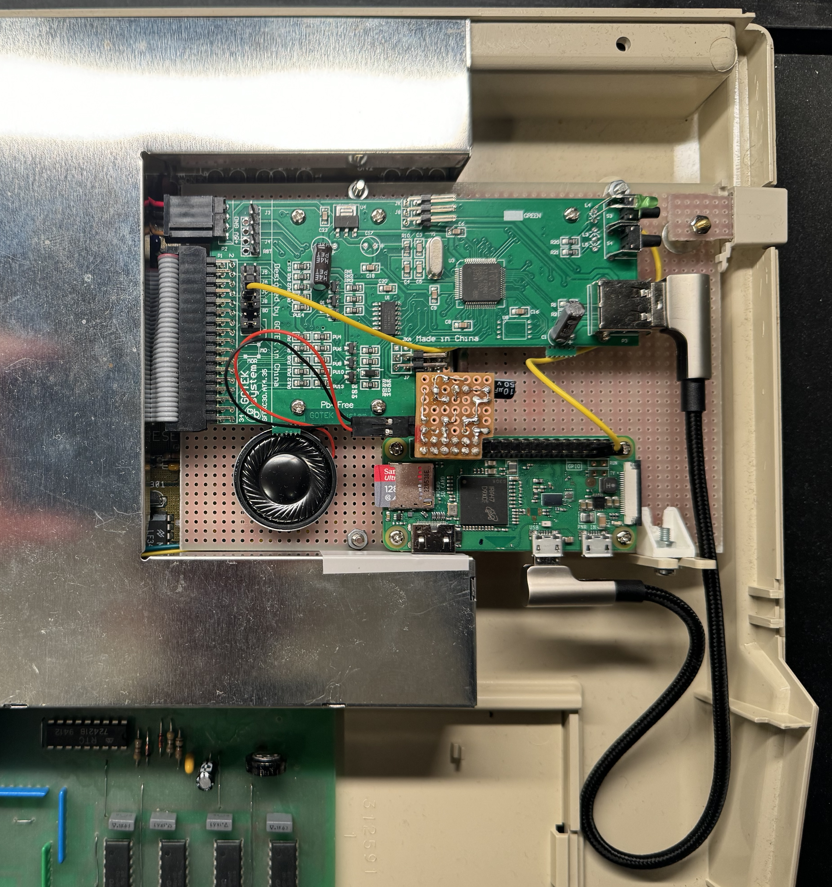

# Amiga Floppy Selector

This project transforms a Raspberry Pi Zero W into an intelligent USB stick that can be used with the [FlashFloppy](https://github.com/keirf/flashfloppy) emulator software to change emulated floppy disks on an Amiga. The Pi mounts itself as a USB Mass Storage Device which to FlashFloppy looks like a USB stick with a single disk image. A simple server is running on the Pi to enable an external application to change disks over Wi-Fi. For extra nostalgia, authentic Amiga 500 insert and eject sounds are played in response to commands if a speaker is attached to the Pi.

A free client app for iOS is available on the [Apple App Store](https://itunes.apple.com/WebObjects/MZStore.woa/wa/viewSoftware?id=6736647574&mt=8).

## Network protocol

The protocol relies on messages terminated by `\n`. The message content must be URL encoded with a scheme compatible with Python's `urllib.parse.quote_plus`. The network connection is closed after each response, or if no command was received within a time period.

### Commands

- `GET_INSERTED_DISK` - Returns the file name of the currently inserted disk image.
- `GET_FILE_LIST` - Returns a list of all disk image files available on the server, separated by `\n`.
- `INSERT_DISK file_name` - Inserts the disk image named `file_name`.
- `EJECT_DISK` - Ejects the currently inserted disk image.

### Response format

- `OK[\nPayload]` - Successful response with optional payload.
- `ERROR[\nMessage]` - Error response with optional error message.

## Operating system

The project uses [Buildroot](https://buildroot.org) to create a fast-booting experience.

## Hardware

